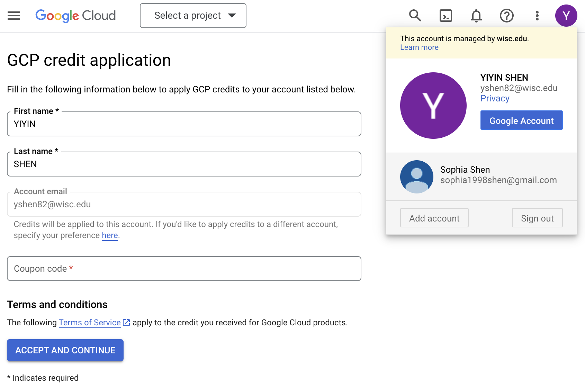
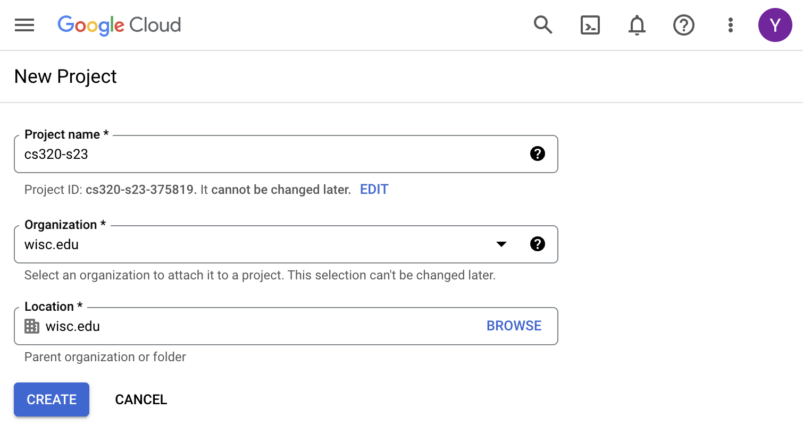
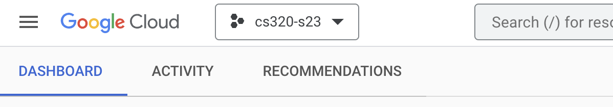

# Google Cloud Signup

## Account and Billing

1. Go to https://cloud.google.com.  Click "Get started". (If prompted to type in any Credit Card information just press skip.) 

2. Use your "@wisc.edu" email address

3. Continue through any remaining steps to create an account.  Sometimes you'll be prompted to enter a credit card -- if that happens, you should be able to move on to the next steps where you redeem the coupon code (it seems enough of the account is created prior to the credit card prompt for you to redeem the coupon and proceed).

4. Look for the Canvas announcement about how to get a free $50 coupon code

5. Go to https://console.cloud.google.com/education

6. Double check that you're signed in as your "@wisc.edu" user (if you use Gmail, it may automatically default to your "@gmail.com" account).  Check this in general whenever using the Google Cloud Console:

7. Go to "Billing": https://console.cloud.google.com/billing

8. Look for "Billing Account for Education" (or similar) and click it

9. Verify that you have $50 remaining

## Project

Any **resources** we create (like virtual machines), are grouped into
**projects**.  Each project is associated with a billing account.

1. Go to the "Manage Resources" page in the console.  It is under the drop-down menu in the top-left: "IAM & Admin" > "Manage Resources".  Or, here is a link for quick access: https://console.cloud.google.com/cloud-resource-manager

2. Click "CREATE PROJECT"

3. Call it "cs320-su23" and associate it with your account that has the free credits.  Sometimes an option will appear to select an organization in which to nest your project.  If this happens, select "wisc.edu".

4. After it is created, click "SELECT PROJECT"

5. In general, when working in the console, make sure your project is selected when given the option

