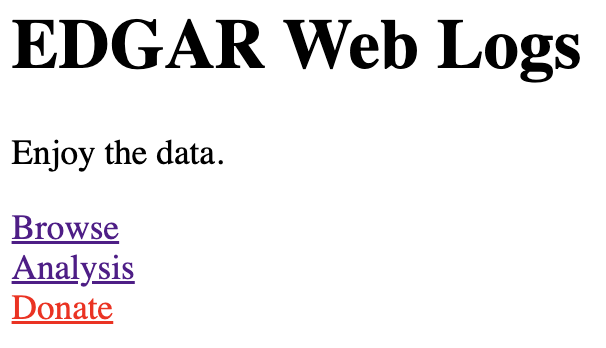
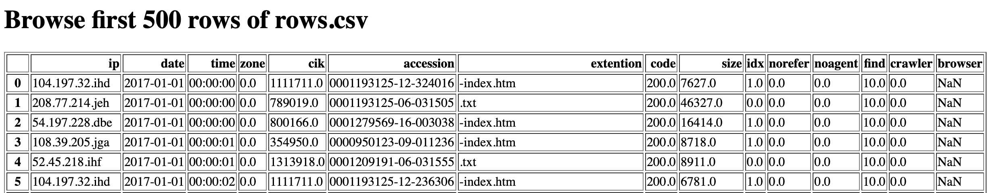
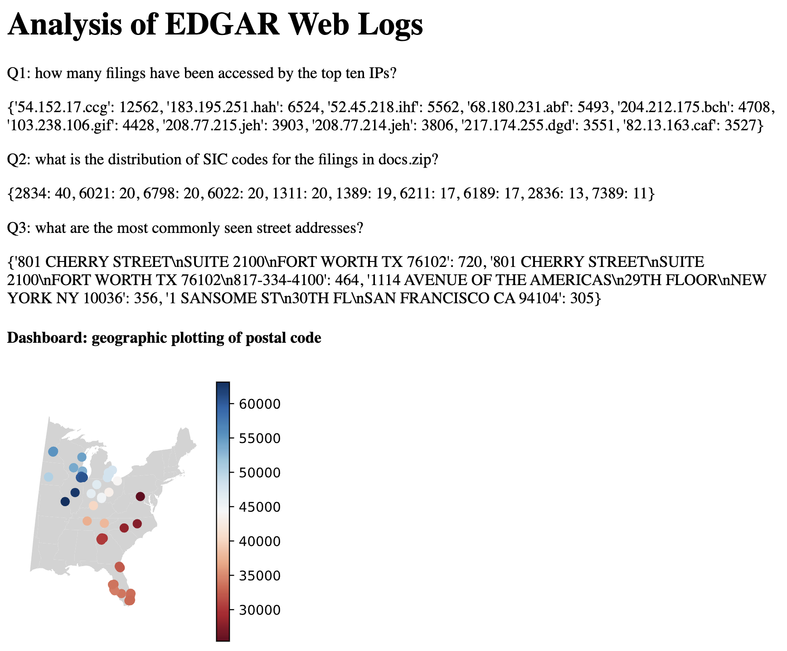

# Project 4: Building a Website Sharing EDGAR Web Logs 

**Important:** This project is the longest one in this semester. 
Please do not wait until the last minute to finish it. 

## Corrections/Clarifications

* none yet

## Hand-in

When you're done, you'll hand in a `*.zip` file containing `main.py`, any 
`.html` files necessary (basically whatever we need to run your website), 
`edgar_utils.py`, and `dashboard.svg`.

You can create a `*.zip` file from the terminal. Let's say you're already in 
a directory named `p4`. You can run this to create a compressed `p4.zip`
file alongside your directory by typing in:

```
zip ../p4.zip main.py *.html edgar_utils.py dashboard.svg
```

**Important:** make sure your program is named `main.py`. 

## Testing
Run `python3 tester.py` inside of your `p4` directory (your program must be named `main.py`) and work on fixing any issues. As in Project 2, the tester will use `module_tester.py` to check your `edgar_utils.py` module.

## Overview

In the US, public companies need to regularly file
various statements and reports to the SEC's (Securities and Exchange
Commission) EDGAR database.  EDGAR data is publicly availe online;
furthermore, web requests to EDGAR from around the world are logged
and published.  EDGAR logs are huge.  Logs for *just one day* might be
about 250 MB compressed as a .zip (or 2 GB uncompressed!).

We'll develop tools to extract information from the filings stored in EDGAR 
(this will be done in a Python module, `edgar_utils.py`). 

We'll also use the flask framework to build a website that displays the analysis 
of user behavior. The website will have the following features:  
 
(1) **a link** to a donation page that is optimized via A/B testing,  
(2) **a page** within the website that displays the data in `html` and `JSON` format,  
(3) **a page** within the website that displays analysis and plots of the data, 
(4) **a homepage page**.


## Setup

First, install some things:

```
pip3 install --upgrade pip
pip3 install Flask lxml html5lib beautifulsoup4 geopandas shapely descartes geopy netaddr
sudo apt install -y python3-rtree
```

# Group Part (75%)

For this portion of the project, you may colorate with your group members in any way (even looking at working code). You may also seek help from 320 staff (mentors, TAs, instructor). You may not seek help from other 320 students (outside your group) or anybody outside the course.

## Data Format
Take a look at the list of daily zips and CSV documentation on the EDGAR site:

- https://www.sec.gov/dera/data/edgar-log-file-data-set.html
- https://www.sec.gov/files/EDGAR_variables_FINAL.pdf

We have provided a `server_log.zip` file, which is a subset of the
records from `log20170101.zip`. Since you'll need to work with a lot 
of zipped files for this project, you'll want to know some command 
line techniques to troubleshoot.

You could use `sudo apt install unzip` to install unzip, and then view names of files in a zip file:

```
unzip -l server_log.zip
```

View the start of a file inside of a zip file (change "head" to "tail"
to see the end):

```
unzip -p server_log.zip rows.csv | head -n 5
```

The expected result is:

```
ip,date,time,zone,cik,accession,extention,code,size,idx,norefer,noagent,find,crawler,browser
104.197.32.ihd,2017-01-01,00:00:00,0.0,1111711.0,0001193125-12-324016,-index.htm,200.0,7627.0,1.0,0.0,0.0,10.0,0.0,
208.77.214.jeh,2017-01-01,00:00:00,0.0,789019.0,0001193125-06-031505,.txt,200.0,46327.0,0.0,0.0,0.0,10.0,0.0,
54.197.228.dbe,2017-01-01,00:00:00,0.0,800166.0,0001279569-16-003038,-index.htm,200.0,16414.0,1.0,0.0,0.0,10.0,0.0,
108.39.205.jga,2017-01-01,00:00:01,0.0,354950.0,0000950123-09-011236,-index.htm,200.0,8718.0,1.0,0.0,0.0,10.0,0.0,
```

Looking at the `cik`, `accession`, and `extention` fields tells you what web resoure a user was requesting (in particular, each company has it's own `cik`):

```
ip,date,time,zone,cik,accession,extention,code,size,idx,norefer,noagent,find,crawler,browser,region
54.212.94.jcd,2017-01-01,03:31:36,0.0,1461219.0,0001209191-21-001287,-index.htm,301.0,243.0,1.0,0.0,1.0,10.0,0.0,,United States of America
...
```

For this row, we can construct the following URL from `1461219.0`, `0001209191-21-001287`, and `-index.htm`:

https://www.sec.gov/Archives/edgar/data/1461219/0001209191-21-001287-index.htm

Looking at this page and its source (as well as the source of the pages where your parser does not behave as expected) is highly recommended and will be very important later in the project.

We have already downloaded the docs for a subset of the requests in
`server_log.zip` for you and placed them in `docs.zip`. Note, however, that the file structure is slightly different than the URL above. The path in the zip to that file would be "1461219/0001209191-21-001287/-index.htm".

Note that by default reading inside a zip gives you bytes.  For your regex work, convert to a string using UTF-8 (like we have done for `check_output`).


## Pages

Your web application should include three pages:
* `index.html`
* `browse.html`
* `donate.html`
* `analysis.html`

To get started, consider creating a basic `index.html` file:

```html
<html>
  <body>
    <h1>EDGAR Web Logs</h1>

    <p>Enjoy the data.</p>
  </body>
</html>
```

Then create a simple flask app in `main.py` with a route for the
homepage that loads `index.html`:

```python
import pandas as pd
from flask import Flask, request, jsonify

app = Flask(__name__)
# df = pd.read_csv("main.csv")

@app.route('/')
def home():
    with open("index.html") as f:
        html = f.read()

    return html

if __name__ == '__main__':
    app.run(host="0.0.0.0", debug=True, threaded=False) # don't change this line!

# NOTE: app.run never returns (it runs for ever, unless you kill the process)
# Thus, don't define any functions after the app.run call, because it will
# never get that far.
```

Try launching your application by running `python3 main.py`:
```
trh@instance-1:~/p4$ python3 main.py
 * Serving Flask app "main" (lazy loading)
 * Environment: production
   WARNING: This is a development server. Do not use it in a production deployment.
   Use a production WSGI server instead.
 * Debug mode: off
 * Running on http://0.0.0.0:5000/ (Press CTRL+C to quit)
```

This program runs indefinitely, until you kill it with `CTRL+C`
(meaning press `CTRL` and `C` at the same time).  Open your web
browser and go to `http://your-ip:5000` to see your page ("your-ip" is
the IP you use to SSH to your VM).

Requirements:

* Going to `http://your-ip:port/browse.html` should return the content for `browse.html`, and similarly for the other pages.
* The index.html page should have hyperlinks to all the other pages.  Be sure to not include your IP here! A relative path is necessary to pass our tests.
* You should put whatever content you think makes sense on the pages.  Just make sure that they all start with an `<h1>` heading, giving the page a title.

Your home page should look like this:



## Part 1: Browse Page

The `browse.html` page should show an HTML table of the first **500** rows of
`rows.csv` from `server_log.zip`.  

The page should look like this:



**Hint 1:** you don't necessarily need to have an actual `browse.html`
file just because there's a `browse.html` page.  For example, here's a
`hi.html` page without a corresponding `hi.html` file:

```python
@app.route('/hi.html')
def hi_handler():
    return "howdy!"
```

For browsing, instead of returning a hardcoded string, you'll need to
generate a string containing HTML code for the table, then return that
string. For example, `"<html>{}<html>".format("hello")` would insert `"hello"`
into the middle of a string containing HTML code. 

**Hint 2:** look into the `compression` parameter of `pandas.read_csv()` and `pandas.to_html()`. 

**Important:** Try to avoid unzipping `server_log.zip`. 

### Rate Limiting JSON Page

JSON files are used to transmit structured data over network
connection.  Add a resource at `https://your-ip:port/browse.json` that
displays the same information as `browse.html`, but in JSON format
(represent the DataFrame as a list of dicts, such that each dict
corresponds to one row).

Check the client IP with `request.remote_addr`.  Do not allow more
than one request per minute from any one IP address.

**Hint 1:** consider combining Flask's `jsonify` with Pandas `to_dict`: https://pandas.pydata.org/docs/reference/api/pandas.DataFrame.to_dict.html

**Hint 2:** we cover rate limiting in the future lecture.

### IP visitors of JSON Page
Now add a resource at `http://your-ip:5000/visitors.json` that returns a list of 
the IP addresses that have visited your `browse.json` resource. 

**Hint 1:** use the client IPs stored in previous exercise (rate limiting). 

## Part 2: Donations

On your donations page, write some text, making your best plea for
funding. Then, let's find the best design for the homepage, so that
it's more likely for the testers to click the link to the donations page.

We'll do an A/B test.  Create two versions of the homepage, say, A and B.
They should differ in some way, perhaps somewhat trivially (e.g., maybe the link
to donations is blue in version A and in red in version B).

For the first 10 times your homepage is visited, alternate between version
A and B each time.  After that, pick the best version (the one where
people click to donate most often), and keep showing it for all future
visits to the page.

**Hint 1:** consider having a `global` counter in `main.py` to keep track of
how many times the homepage has been visited.  Consider whether this
number is 10 or less and whether it is even/odd when deciding between
showing version A or B for alternations.

**Hint 2:** when somebody visits `donate.html`, we need to know if
  they took a link from version A or B of the homepage.  The easiest
  way using query strings. On version A of the homepage, instead of
  having a regular link to `donate.html`, link to
  "donate.html?from=A", and in the link on version B to `donate.html`,
  use "donate.html?from=B".  Then the handler for the `donate.html`
  route can keep count of how much people are using the links on both
  versions of the home page.
  
**Hint 3:** You don't necessarily need to have two different versions
of your homepage to make this work. You could use the templating
approach: once you read your `index.html` file into your program, you
can edit it. At that point it should be a string, so you could add
something to it or replace something in it.

## Part 3: creating `edgar_utils.py` module

This part is to be started during [lab 10](../labs/EDGAR.md). 

Finish the `edgar_utils.py` module now if you didn't have enough time
during the scheduled lab.


# Individual Part (25%)
You have to do the remainder of this project on your own. Do not discuss with anybody except 320 staff (mentors, TAs, instructor).

On your homepage, display some analysis and a plot of the EDGAR Web Logs in the format of:

```
<p>Q1: how many filings have been accessed by the top ten IPs?</p>
<p>???</p>
<p>Q2: what is the distribution of SIC codes for the filings in docs.zip?</p>
<p>???</p>
<p>Q3: what are the most commonly seen street addresses?</p>
<p>???</p>
<h4>Dashboard: geographic plotting of postal code</h4>
```

Details of the questions can be found below.  

**Suggestion:** 
1. Use helper functions, `str.replace()`, and `str()` to help you fill out `???`. 
2. Complete these questions in a notebook. Then move them to `main.py`. 

The result should look like this:



### Q1: how many filings have been accessed by the top ten IPs?

Answer with a dictionary, with the (anonymized) IP as key and the number of requests seen in `server_log.zip` as the values. Each row in the logs corresponds to one request. Note that the anonymized IP addresses are consistent between requests.

**Hint:** for this question and most of the others expecting dictionary output, it might be easiest to use Pandas operations to process the data into a `Series` and to use the `to_dict()` method. Consider using tools like `groupby`, `apply`, and aggregation methods like `size()`. In Q30-32 from [P1](../p1/README.md), there is an example of `apply`.

### Q2: what is the distribution of SIC codes for the filings in `docs.zip`?

Read the HTML from this file and use it to create a `Filing` object,
from which you can access the `.sic` attribute.

Answer with a dict, like the following:

```
{2834: 40,
 6021: 20,
 6798: 20,
 6022: 20,
 1311: 20,
 1389: 19,
 6211: 17,
 6189: 17,
 2836: 13,
 7389: 11}
```

Skip any `None` values (`None` shouldn't be a key in the final dict).

**Suggestion:** read every .htm or .html file in `docs.zip`, creating a
`Filing` object from each.  Save the Filing objects in a dict, keyed
by filename, so you don't need to re-read the data for each of the
following questions.

### Q3: what are the most commonly seen street addresses?

For each request ("cik/accession/extention") in the `server_log.zip` that has a corresponding 
filing in `docs.zip`, count each of the addresses for that filing. 
(ignore rows in the logs which refer to pages not in `docs.zip`).

Show a dictionary of counts for all addresses appearing at least 300
times.

### Dashboard: geographic plotting of postal code

The `locations.geojson` contains the positions of some of the
addresses in the dataset.  Plot this over the background map in
"shapes/cb_2018_us_state_20m.shp"

Additional requirements:

* crop to the following lat/lon bounds:

```python
west = -95
east = -60
north = 50
south = 25
```

* use a Mercator projection, "epsg:2022"
* the color of each point should indicate the postal code. For example, the postal code of `245 SUMMER STREET\nBOSTON MA 02210` is `2210`. If it's in the form like `53705-1234`, only take `53705`. If it's neither 5 digits number nor 9 digits number, don't use the point.
* only show the street with a postal code from 25000 to 65000
* use the "RdBu" colormap, with a colorbar
* the color of background is "lightgray"

Finally, display this plot on your homepage in the SVG format via a flask route. 
You can add the plot by adding the following line to the `index.html` file 
(you're encouraged to use more descriptive names for your .svg routes).
```

```
To help your TAs grade this plot, please also save this plot as `dashboard.svg` 
and include it in `p4.zip`. 

#### Important

* Ensure you are using the `Agg` backend for matplotlib, by explicitly setting
    ```python
    matplotlib.use('Agg')
    ```
    right after importing matplotlib.

* Ensure that `app.run` is launched with `threaded=False`.
    
* Further, use `fig, ax = plt.subplots()` to create the plots and close the plots after `savefig` with `plt.close(fig)` (otherwise you may run out of memory).

## Concluding Thoughts
The EDGAR logs are supposedly anonymized (with the last three docs
left), but we can still tell where the users live and what they're
looking at.

 By connecting the filing information with the logs, we can learn a lot about the behavior of the investment firms which use the database - for example, we might learn which companies (or industries) a hedge fund might be considering investing in, and the extent to which it relies on automated vs manual research in its trading.

Others have used this same data to make good guesses
about what docs various hedge funds and others are looking at, then
correlate that with success.  For those interested in the nitty-gritty
details of what could be done with this data, take a look at this
early-stage work: [Hedge Funds and Public Information
Acquisition](https://papers.ssrn.com/sol3/papers.cfm?abstract_id=3127825).
